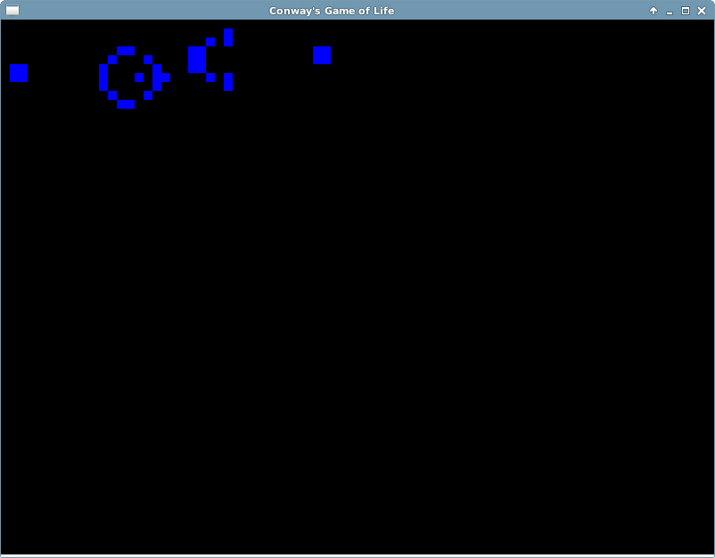
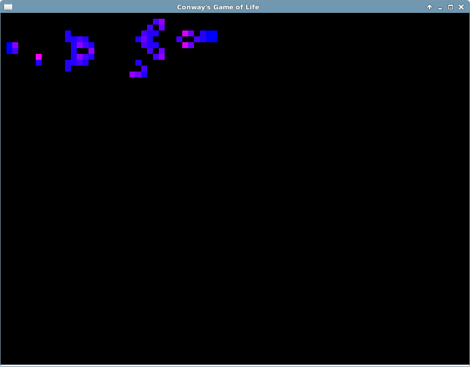
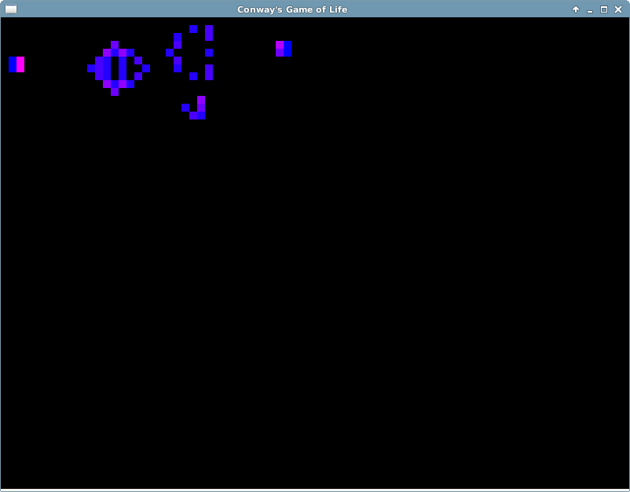
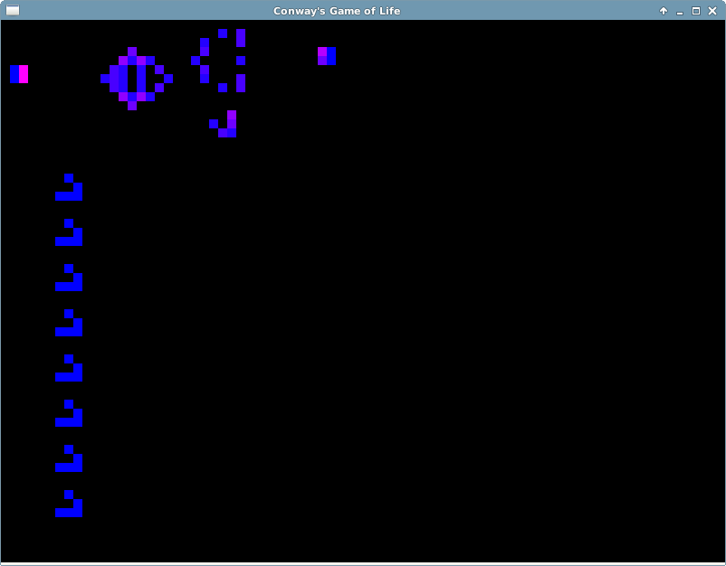
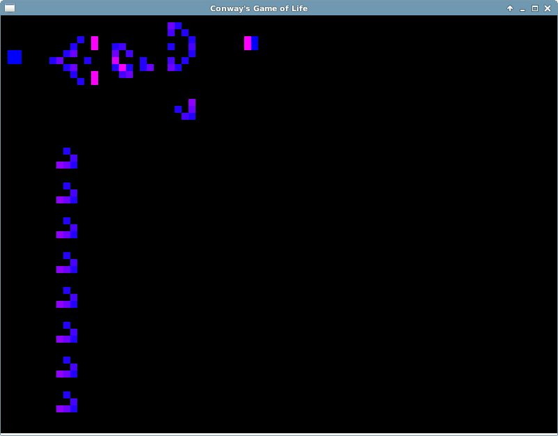
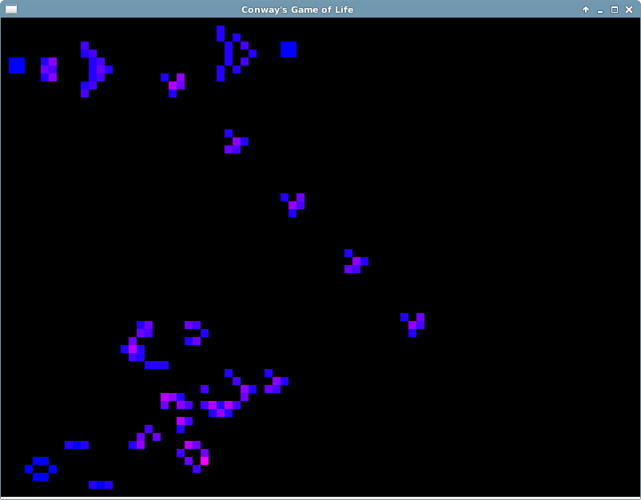
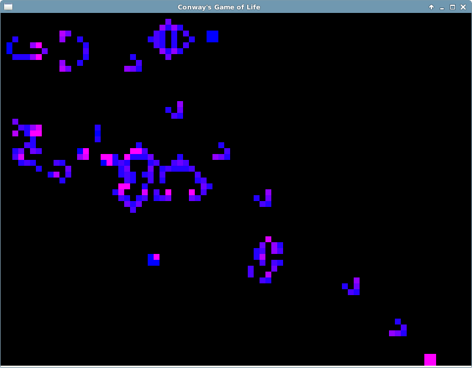
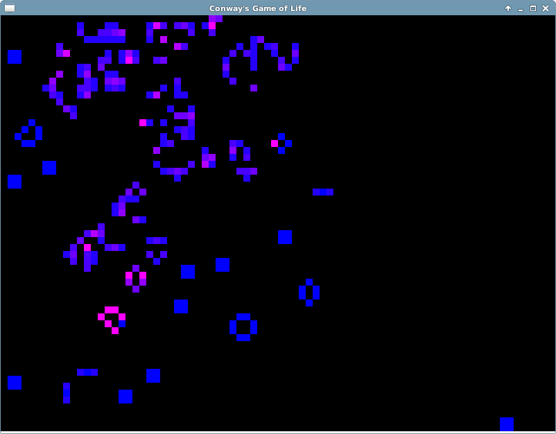
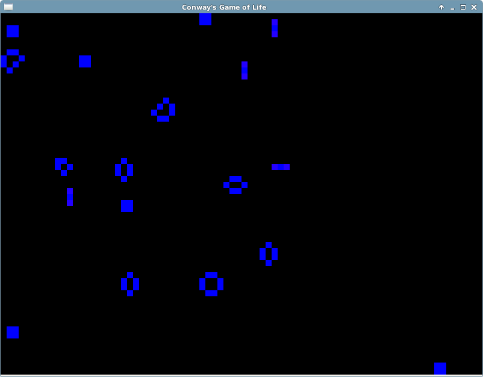

# CSC 213 &ndash; Final Project

Anna Blinderman, David Kraemer, Zachary Segall

We built a version of [Conway's Game of Life](https://en.wikipedia.org/wiki/Conway's_Game_of_Life). 
Conway's Game of Life is a cellular automata simulation invented by
the mathematician John Conway in 1970. It was originally devised to
solve problems relating to Turing and Von Neumann machines, 
but has been used in a variety of fields since then. 
Conway's Game of Life is a particularly salient example of complex systems
emerging from a simple set of rules. 
It acts as a basic population growth model - a cell's state is determined by its neighbors
(from wikipedia):
1. Any live cell with fewer than two live neighbours dies, by underpopulation.
2. Any live cell with two or three live neighbours lives on to the next generation.
3. Any live cell with more than three live neighbours dies, by overpopulation.
4. Any dead cell with three live neighbours becomes a live cell, by reproduction.
We also added extra features to the basic implementation of the game, described below.
 
# General Instructions 

This guide assumes that the executable file `life` exists at the root of the
repository. If it does not exist, run
```
$ make
```
at the root of the repository, which will produce the executable. To run the
program without a preset board, run
```
$ ./life
```
which generates a blank SDL window. This is the Game of Life simulator,
initialized in pause mode. 

## User input

User input is read from the mouse and from the keyboard. By left-clicking a
cell, or left-clicking and dragging through multiple cells, the user toggles
the cell(s) to the "living" state. By right-clicking a cell, or right-clicking
and dragging through multiple cells, the user toggles the cell(s) to the "dead"
state.

The following keyboard commands provide additional mechanisms for user
interface:

| Command | Description |
|:--------|:------------|
| `CTRL-P` | Toggles between paused and unpaused simulation modes. |
| `CTRL-C` | Clears the game board of all living cells. |
| `CTRL-G` | Populates the region of cells where the mouse is located with a glider<sup>1</sup> cell. |
| `CTRL-Q` | Quits the simulation (and exits the SDL window). |
| `CTRL-SPACE` | Advances one step through the simulation (only valid when in pause mode). |

## Adjustable settings

The parameters for the simulation can be adjusted from the life.hh file:

| Variable | Description |
|:--------|:------------|
| `BMP_WIDTH, BMP_HEIGHT` | Dimensions of display in pixels |
| `CELL_DIM` | Size of cells in pixels |
| `DELAY` | Time in ms between updates. |
| `colors` | Cells change color based on age. There is an array of colors that determines endpoints and interpolation |

## Loading preset boards

An instance of the Game of Life simulator can begin with a preset board. In the
`boards/` directory, there exist game board files which specify an initial
configuration of the board. given a game board file, `sample.board`, the usage 
for the program is
```
$ ./life boards/sample.board
```

## Specific Example 

In this example we will explore the glider gun<sup>2</sup> pattern. The file
`gun.board` is provided in the `boards` directory. We load the board into the
program using
```
$ ./life boards/gun.board
```
This produces the image:



Let's update the board a few times manually. If we press `CTRL-SPACE` 23 times,
we get the first glider:



Notice how the colors of the glider gun have changed dramatically. This is
because the colors indicate the advancing age of each living cell. Let's
advance a bit more by pressing `CTRL-SPACE` 6 times. We now have the board:



Let's add a bunch of gliders. Remember that you can draw a glider on the grid
by pressing `CTRL-G`:



These are all going to evolve the same way, so let's advance by 7 turns using
`CTRL-SPACE`. We end up with the board:



We're about to get a new glider from the gun, but at this point, let's just see
how this runs for a while. Pressing `CTRL-P`, we can see the real-time
evolution of our board.



Here we see the glider gun in action, having produced a good number of gliders.
Also, there seemed to have been some interactions (read: explosions) between
our gliders on the left. Interesting! Let's see some more.



The conflagration to the left looks like it might interfere with the glider
gun.  But right now, everything is still intact. You can see that the gliders
are all colliding on the bottom right, which is because the boundary of the
game board is a hard wall.



Oh no, our glider gun exploded! Oh well...



This is the steady state of our game of life. It's kind of sad, but still neat.


<sup>1</sup>The glider is a pattern that steadily traverses the board: 


<sup>2</sup>The glider gun is a pattern that steadily produces gliders:


## Other Branches - Evaluations

In order to evaluate the effectiveness of our parallelization, we implemented a number of variations of our program. We have three categories, each of which is in one of the following branches. We also create a csv file to hold the THREADS_PER_BLOCK, REGION_SIZE, number of iterations completed, and time for most recent update (in ms) in each of these branches. Thus, when we run any of this code, we create a data file for our analysis. 

### evaluations_serial: 

We also implemented a serial version of our update function in order to gauge the effectiveness of our GPU parallelization. The code in this branch is otherwise identical to that in our main implementation. 


### evaluations_parallel: 

This is the same implementation as in our master branch.


### evaluations_parallel_optimized: 

Because it is sometimes the case that large regions of our board have no live cells in them, it is wasteful to run our update function on those regions. Thus, we overlaid a lower-dimension grid over our board in order to track the number of live cells in each region. If there are no live cells in the region, we do not run the update function on any of the cells within it. Although there are a few edge cases for which this optimization does not account (there could be live cells on the border of a region that would cause a cell within the region to come alive at the next iteration), this test was still useful in gauging the effectiveness of this optimization.


